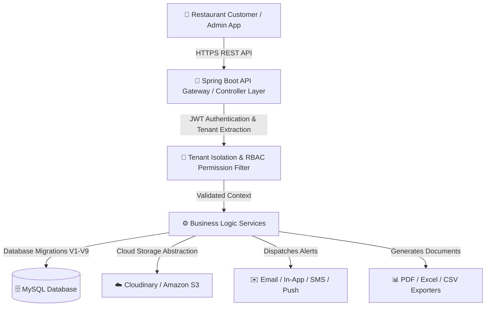
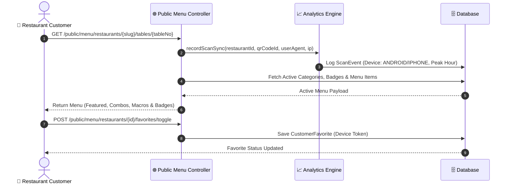
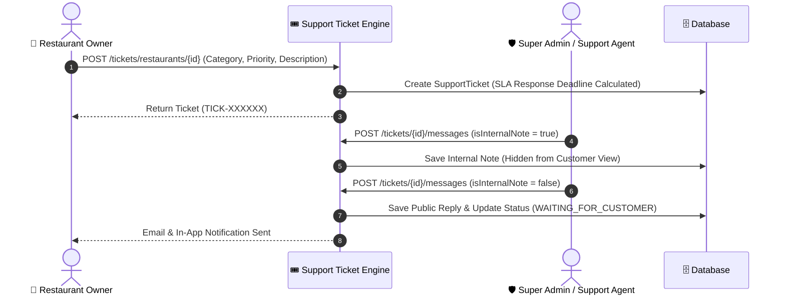

# 🍽️ Restaurant QR Menu SaaS Platform Backend

[](https://spring.io/projects/spring-boot)
[](https://www.oracle.com/java/)
[](LICENSE)
[]()

Production-Grade, Multi-Tenant B2B SaaS Backend for Digital Restaurant QR Menus, Analytics, Subscriptions, Multi-Cloud Media, PDF/Excel Reports, Multi-Channel Notifications, WhatsApp-Style Support Ticketing, Developer Webhooks, and White-Label Domains.

---

## 📐 System Architecture & Workflow Diagrams

### 1. Multi-Tenant Architectural Flow


### 2. QR Code & Public Customer Order Flow


### 3. Support Ticket System & WhatsApp-Style Chat Flow


---

## 🗄️ Database ER Schema & Migrations (`V1` – `V9`)

The database uses **Flyway** for automatic, version-controlled migrations:

| Version | Migration File | Key Tables & Functionality Introduced |
| :--- | :--- | :--- |
| `V1` | `V1__init.sql` | `restaurants`, `branches`, `categories`, `menu_items`, `offers`, `qr_codes`, `users` |
| `V2` | `V2__saas_foundation.sql` | `staff_invitations`, `audit_logs`, Soft-delete metadata (`deleted_by`) |
| `V3` | `V3__subscription_saas.sql` | `subscriptions`, `coupons`, Multi-tier plans (`STARTER`, `PROFESSIONAL`, `BUSINESS`, `ENTERPRISE`), Free trial engine |
| `V4` | `V4__dashboard_analytics.sql` | `search_logs`, `scan_events` analytics indexing |
| `V5` | `V5__customer_experience.sql` | `customer_favorites`, Badges (`isPopular`, `isChefSpecial`), Macros (`protein`, `fat`, `carbs`), Dietary tags |
| `V6` | `V6__media_center.sql` | `media_assets` (Cloudinary & S3 multi-cloud, WebP compression metadata, Cropping) |
| `V7` | `V7__notification_center.sql` | `notifications` (Email, In-App, SMS, Push multi-channel dispatches & inbox) |
| `V8` | `V8__support_ticket_system.sql` | `support_tickets`, `ticket_messages`, `knowledge_articles`, `saved_replies` |
| `V9` | `V9__super_admin_and_enterprise.sql` | `platform_announcements`, `system_settings`, `api_keys`, `webhook_subscriptions`, `custom_domains`, `system_backups` |

---

## 🎯 12-Phase Complete Deliverables Matrix

### Phase 1 — Core Foundation
- **JWT & Password Security**: BCrypt password hashing, JWT Access/Refresh tokens, Forgot/Reset password flow.
- **Restaurant & Branch Hierarchies**: Multi-branch support, active/inactive toggles, default branch setup.
- **Categories & Menu Items**: Display order, hide/show, soft-deletes, veg/non-veg tags.
- **QR Engine**: Unique Branch & Table QR code generation with download options.

### Phase 2 — SaaS Foundation
- **Granular RBAC Permissions**: Roles (`SUPER_ADMIN`, `OWNER`, `MANAGER`, `STAFF`) mapped to 10+ explicit permissions.
- **Staff Invitation System**: Tokenized email invitations with expiration, role assignment, and password setup.
- **Audit Logging**: Change tracking recording user, action, entity, timestamp, IP, and payload diffs.
- **Soft Delete Restoration**: Undelete/Restore API endpoints for recovered data.

### Phase 3 — Subscription SaaS
- **Multi-Tier SaaS Engine**: `STARTER` (1 Branch, 100 Items), `PROFESSIONAL`, `BUSINESS`, `ENTERPRISE`.
- **Free Trial Engine**: 14-day automated free trial with countdown timers and grace periods.
- **Coupons & GST Invoicing**: Percentage/flat discount coupons, usage limits, and GST invoice generation.

### Phase 4 — Restaurant Dashboard Analytics
- **KPI Cards**: Today's QR Scans, Unique Visitors, Top Popular Item, Revenue, Active Offers.
- **Time-of-Day Heatmaps**: Hour-by-hour scan distribution (Lunch 12-3 PM vs Dinner 7-11 PM peaks).
- **Search Analytics**: Tracks customer queries (e.g. "Burger", "Pizza") for restaurant menu optimization.

### Phase 5 — Customer Experience
- **Badges & Macros**: Chef Special, Popular badge, Spice Level (0-5), Protein, Fat, Carbs, Calories.
- **Dietary Certifications**: Vegan, Halal, Jain, Gluten-Free, Allergen tags.
- **Customer Favorites Engine**: Bookmark favorite items by device token.

### Phase 6 — Media Center
- **Multi-Cloud Storage Engine**: Unified `StorageProvider` abstraction for Cloudinary and Amazon S3.
- **WebP Compression**: Converts PNG/JPEG uploads to lightweight `.webp` format automatically.
- **Gallery & Cropping**: Multi-image drag-and-drop batch upload, cropping API, and CDN URL generator.

### Phase 7 — Multi-Format Reports
- **Export Engine**: Generates **PDF**, **Excel (XLSX)**, and **CSV** data files.
- **7 Report Domains**: Daily, Monthly, Revenue, QR Scans, Menu Performance, Staff Activity, Subscription Billing.

### Phase 8 — Notification Center
- **Multi-Channel Dispatch**: Email, In-App, SMS, and Push alerts.
- **Event Triggers**: Subscription expiring, offer ending, new staff joined, QR generated, payment received.
- **Inbox Management**: Unread counter, mark read, mark all read, soft-delete notifications.

### Phase 9 & 10 — Support Ticket System ⭐
- **WhatsApp-Style Chat**: Multi-media attachments (Images, PDF, Videos, Logs) and internal notes (hidden from customers).
- **SLA Engine & Escalation**: SLA response/resolution deadlines with 4-level escalation (`LEVEL_1` $\rightarrow$ `LEVEL_2` $\rightarrow$ `DEVELOPER` $\rightarrow$ `MANAGER`).
- **Knowledge Base**: Self-service FAQ articles and auto-suggestion search endpoint.

### Phase 11 & 12 — Super Admin SaaS Panel & Enterprise Features
- **MRR & ARR Financial Engine**: Automated MRR ($MRR = \sum \text{Active Plan Monthly Revenue}$) and ARR ($ARR = MRR \times 12$).
- **Developer API Keys & Webhooks**: Subscriptions for `ORDER_CREATED`, `SCAN_LOGGED`, `MENU_UPDATED` events with secret signatures.
- **White-Label & Custom Domain**: Custom domain CNAME verification (`menu.gourmetbistro.com`), custom CSS, and white-label logo.
- **Disaster Recovery**: Automated database backup triggers and public status page (`GET /enterprise/status-page`).

---

## 🛠️ Setup & Running Instructions

### 1. Prerequisites
- **Java**: JDK 17 or higher
- **Maven**: 3.8+
- **MySQL**: 8.0+

### 2. Environment Configuration
Create an `application-local.yml` or set environment variables:
```yaml
DB_URL: jdbc:mysql://localhost:3306/restaurant_qr_db?useSSL=false&serverTimezone=UTC&allowPublicKeyRetrieval=true
DB_USERNAME: root
DB_PASSWORD: admin
JWT_SECRET: 404E635266556A586E3272357538782F413F4428472B4B6250645367566B5970
```

### 3. Build & Run
```bash
# Run 109 automated unit and integration tests
mvn clean test

# Package Spring Boot executable JAR
mvn clean package

# Run local development server
mvn spring-boot:run
```

---

## 🧪 Verification & Test Results
```
[INFO] Results:
[INFO] 
[INFO] Tests run: 109, Failures: 0, Errors: 0, Skipped: 0
[INFO] 
[INFO] ------------------------------------------------------------------------
[INFO] BUILD SUCCESS
[INFO] ------------------------------------------------------------------------
```

---

## 📜 License
This project is licensed under the MIT License - see the [LICENSE](LICENSE) file for details.
